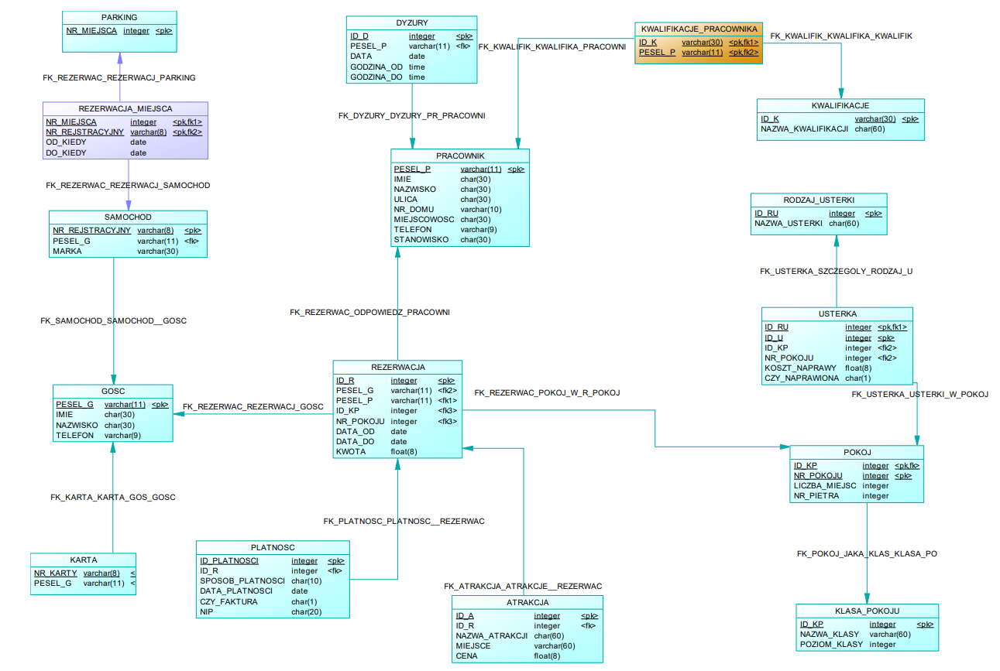

# Hotel Database Project - SQL Sybase SQL Anywhere 12

Welcome to the Hotel Database Project repository! This repository contains a comprehensive SQL database designed for managing a hotel's operations. The entire database schema was meticulously crafted using Power Designer and is compatible with Sybase SQL Anywhere 12.

More informations under DB model.



## Project Goals
- Every guest can make multiple reservations.
- Each room can be reserved multiple times.
- Each reservation must have specific start and end dates and an associated cost.
- Payments are processed alongside reservations.
- Each car must be assigned to a specific guest.
- Each reservation must be linked to an employee responsible for it.
- Every reservation may, but is not required to, have associated amenities.
- Each room is of a certain class and has a maximum occupancy.
- The hotel only tracks the person making the room reservation, not all guests.
- Every maintenance issue is recorded with an indication (Y/N) of whether it has been resolved.

## Repository Contents
- [create_db.sql](create_db.sql) - SQL files for generating the database.
- [insert-queries.sql](insert-queries.sql) - Insert scripts.
- [views.sql](views.sql) - Views.
- [procedures.sql](procedures.sql) - Procedures.
- [functions.sql](functions.sql) - Functions.
- [triggers.sql](triggers.sql) - Triggers.
- [sample-queries.sql](sample-queries.sql) - Sample queries.

This repository serves as a valuable resource for understanding and utilizing this hotel management database effectively. Whether you're a database enthusiast, a hotel manager, or a curious learner, you'll find something here to explore and utilize.

Clone this repository to dive into the world of hotel database management.

## Instructions for Use

### Views

1. **vAktualneRezerwacje (vCurrentReservations)**
   - This view displays information about currently ongoing reservations in the hotel.
   - It shows Reservation ID, guest details, the responsible employee, guest's contact number, room information, and reservation dates.

2. **vmRezerwacjeOplaconeKarta (vmPaidCardReservations)**
   - This materialized view displays all past reservations that were paid with a credit card.
   - It provides information about the guest, the employee responsible for the reservation (and payment), the room number for which the payment was made, the credit card number used for payment, the amount, and payment date.

3. **vPracownicyZprawoJazdyB (vEmployeesWithDriverLicenseB)**
   - This view displays information about hotel employees who possess a category B driver's license.
   - It also includes information about the employee's position.

### Procedures

1. **dodajNowaRezerwacje (addNewReservation)**
   - This procedure handles the complete process of adding a new reservation, including recording the required payment confirmation before order approval.
   - Accepts arguments: guest's PESEL, the PESEL of the employee responsible for registration, room number, reservation amount, payment method, start and end dates, invoice issuance (yes/no), and NIP number.
   - The procedure increments the primary key value for added records and terminates if an error occurs during any transaction step.

2. **pZamiana_dyzurow (changeShift)**
   - This procedure accepts arguments: shift ID, the PESEL of employee 1 (to whom the shift is currently assigned), and the PESEL of the employee to whom the shift should be transferred.
   - It checks the existence of the specified shift and employees and updates the DYZURY table accordingly if conditions are met.

3. **pObliczRabat (calculateDiscount)**
   - This procedure accepts the guest's PESEL as an argument and determines whether the guest is eligible for a discount based on the total number of days from all of their reservations.
   - Discounts are calculated as follows: 0-10 days (5%), 11-25 days (10%), and over 25 days (20%).
   - The procedure provides appropriate information if the guest is not eligible for a discount.

### Functions

1. **fTra_WydluzRezerwacje (fExtendReservation)**
   - This function extends a reservation by a specified number of days.
   - Accepts Reservation ID and the number of days to extend.
   - Transaction is terminated if the reservation ID is invalid or if any query during the process encounters an error.

2. **fCzyAktualnaRezerwacja (fIsCurrentReservation)**
   - This function checks if a specified room is currently occupied.
   - Accepts room number as an argument.
   - Returns "Occupied" if the room is currently occupied; otherwise, returns "Vacant."

3. **fRaportOusterkach (fDefectReport)**
   - This function uses a cursor to return the count of defects in the Results section.
   - In the Messages section, it generates a report of defects recorded in the hotel, including all defect details.

### Triggers

1. **czyPoprawneSamochod (isValidCar)**
   - Trigger executed after an insert or update operation on the SAMOCHOD table.
   - Verifies the correctness of the entered data: checks if the registration number has the correct length and if the PESEL is valid in terms of the number of characters.

2. **czyPoprawnyTelefon (isValidPhoneNumber)**
   - Trigger executed after adding a new guest.
   - Checks whether a valid phone number has been entered. If not, it aborts the addition and displays an error.

3. **befKlientInfo (beforeDeleteCustomerInfo)**
   - If you want to delete a customer, this trigger calculates the number of reservations made by the customer and the total revenue earned by the hotel from them.

### How to use procedures?

PROCEDURE WITH TRANSACTION dodajNowaRezerwacje performs the full reservation process including payment approval. Example entry:
```sql
CALL dodajNowaRezerwacje('89465646465', '82671345246', 3, 650, 'GOTOWKA', '2021-09-22', '2021-09-28', 'N', '-');
```
Payment methods are: 'GOTOWKA', 'KARTA', 'BON'.
Determine if the invoice is 'Y' and 'N'. If 'N' then we enter '-' in NIP.